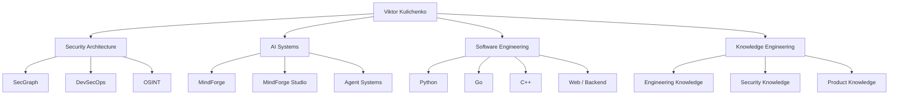

# Viktor Kulichenko

**Security Architecture · AI Systems · Software Engineering**

I design secure, knowledge-driven software and AI systems with an emphasis on explainable engineering decisions, reproducible experiments, and evidence-backed architecture.

## Engineering domains

- **Security Architecture** — security engineering, DevSecOps, OSINT, security automation, threat modeling, compliance.
- **AI & Agent Systems** — MindForge, multi-agent systems, RAG, MCP, knowledge graphs, evidence-driven agents.
- **Software Engineering** — Python, Go, C++, backend engineering, APIs, databases, Linux, Docker, Nginx.
- **Knowledge Engineering** — structured technical knowledge bases for humans and autonomous agents.

## Featured engineering

- [MindForge](https://github.com/VictorKVS/MindForge) — AI and agent engineering ecosystem.
- [SecGraph](https://github.com/VictorKVS/SecGraph) — knowledge-driven security audit and pentest platform.
- [MindForge Studio](https://github.com/VictorKVS/MindForge-Studio) — engineering environment for the MindForge ecosystem.
- [AI Neural Networks](https://github.com/VictorKVS/AI_Neural_Networks) — structured neural-network engineering track.

## Architecture map

## Engineering principle

> Prefer the smallest reliable solution that satisfies the constraints. Technical choices should be explainable through context, alternatives, evidence, tests, benchmarks, and security considerations.

This portfolio is being reorganized into a connected engineering ecosystem. Older educational and experimental repositories will gradually be consolidated into structured learning tracks and evidence-based knowledge bases.

---

**Navigation:** [GitHub profile](https://github.com/VictorKVS) · Portfolio site — planned · LinkedIn — to be connected
