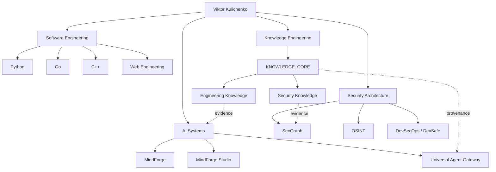

# VIKTOR KULICHENKO

### Security Architecture · AI Systems · Knowledge Engineering · Software Engineering

> **Engineering systems that can explain why they were built this way.**

I design secure, knowledge-driven software and AI systems with an emphasis on explainable engineering decisions, reproducible experiments, evidence-backed architecture and security by design.

**Portfolio status:** active transformation into an evidence-backed MVP showcase  
**Architecture:** [Ecosystem map](docs/ECOSYSTEM.md) · **Showcase index:** [Engineering Showcase](docs/SHOWCASE_INDEX.md) · **Transformation plan:** [Portfolio plan](docs/PORTFOLIO_TRANSFORMATION_PLAN.md) · **Agent metadata:** [`.ai/manifest.yaml`](.ai/manifest.yaml)

---

## Featured engineering

The repositories below are the current flagship candidates. Maturity labels are intentionally conservative and are upgraded only after repository-level evidence review.

### 📚 [KNOWLEDGE_CORE](https://github.com/VictorKVS/KNOWLEDGE_CORE) — **ACTIVE KNOWLEDGE SYSTEM**
Evidence-driven knowledge infrastructure for engineering and security. Current work includes source provenance, atomic requirement verification, CI proof floors, cross-domain security knowledge and adversarial completeness checks.

### 🛡 [SecGraph](https://github.com/VictorKVS/SecGraph) — **PRODUCT / MVP CANDIDATE**
Knowledge-driven security audit, intelligence and pentest platform. The portfolio audit is verifying the exact runnable MVP boundary before promoting the maturity label.

### 🔎 [OSINT_deepseek](https://github.com/VictorKVS/OSINT_deepseek) — **ACTIVE DEVELOPMENT**
OSINT engineering project focused on structured analyst workflows, automation, evidence and reproducible decision lineage.

### 🧠 [MindForge Studio](https://github.com/VictorKVS/MindForge-Studio) — **ACTIVE PRODUCT REPO**
Engineering environment for the MindForge ecosystem. Its relationship to the older MindForge repositories is being normalized into one canonical product line.

### 🤖 [MVP / Universal Agent](https://github.com/VictorKVS/MVP) — **PROTOTYPE / MVP SPEC**
Universal Agent Gateway direction: a minimal controlled gateway for AI-agent actions with policy/decision logic, provider integration, security boundaries and audit logs. Runnable evidence is being verified before a stronger maturity claim.

### 🏭 [META-FOUNDRY](https://github.com/VictorKVS/META-FOUNDRY) — **PLATFORM VISION**
Meta-engineering layer connecting AI, security, knowledge systems and system architecture. It is presented as an ecosystem architecture layer, not as a claim that every envisioned component is already shipped.

[See the working showcase truth model →](docs/SHOWCASE_INDEX.md)

---

## Engineering domains

| 🛡 Security Architecture | 🧠 AI Systems & Agents | ⚙️ Software Engineering | 📚 Knowledge Engineering |
|---|---|---|---|
| Security architecture | MindForge | Python | Engineering knowledge |
| Threat modeling | Agent systems | Go | Security knowledge |
| DevSecOps | RAG / MCP | C++ | Product knowledge |
| OSINT | Knowledge graphs | Backend / Web | Research & evidence |
| Security automation | AI research | Databases / Linux | ADR / benchmarks |

---

## Ecosystem architecture

[Explore the full ecosystem architecture →](docs/ECOSYSTEM.md)

---

## Evidence-driven engineering

The target is not the cleverest solution. The target is the **smallest reliable solution that satisfies the real constraints**.

Technical decisions should be traceable through:

`Context → Constraints → Alternatives → Evidence → Decision → Implementation → Tests → Security Review → Measurement`

The portfolio is being normalized around the same principle. A project will not be promoted to **MVP** merely because a README uses the word. Flagship repositories are expected to show a reproducible execution path, current feature boundary, architecture, tests or validation evidence, known limitations and current status.

Knowledge bases in this ecosystem connect official documentation, standards, research, implementation evidence and reproducible experiments to engineering decisions. Both people and agents should be able to answer not only **what** was chosen, but **why**.

## Engineering languages

**Python** — AI, orchestration, backend, automation and data.  
**Go** — concurrent services, networking, infrastructure and security tooling.  
**C++** — algorithms, systems engineering, performance and native components.

The language is selected from the constraints of the problem rather than preference alone.

---

## Portfolio normalization in progress

The GitHub account contains both current products and a substantial learning history. The transformation keeps that history but separates it from the flagship product layer.

Current normalization work:

- classify repositories as `FLAGSHIP / MVP / PROTOTYPE / RESEARCH / KNOWLEDGE / LEARNING ARCHIVE`;
- resolve duplicate/superseded product identities;
- normalize flagship README contracts;
- add architecture, quick-start, limitations, tests/CI and evidence;
- move old coursework out of the visual foreground without deleting the learning history;
- expose both human-readable and agent-readable navigation.

[Read the full transformation plan →](docs/PORTFOLIO_TRANSFORMATION_PLAN.md)

---

### Repository navigation standard

Every flagship repository will progressively expose two complementary interfaces:

**For people:** concise product statement · problem · current capabilities · architecture · demo · limitations · evidence · roadmap.  
**For agents:** `.ai/manifest.yaml` · relationships · capabilities · evidence references · decision records.

---

**GitHub:** [VictorKVS](https://github.com/VictorKVS) · **Portfolio site:** planned · **LinkedIn:** to be connected

Building secure systems. Engineering intelligence. Sharing knowledge.
