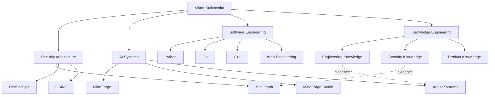

# VIKTOR KULICHENKO

### Security Architecture · AI Systems · Software Engineering

> **Engineering systems that can explain why they were built this way.**

I design secure, knowledge-driven software and AI systems with an emphasis on explainable engineering decisions, reproducible experiments, evidence-backed architecture and security by design.

**Portfolio:** under construction · **Architecture:** [Ecosystem map](docs/ECOSYSTEM.md) · **Agent metadata:** [`.ai/manifest.yaml`](.ai/manifest.yaml)

---

## Engineering domains

| 🛡 Security Architecture | 🧠 AI Systems & Agents | ⚙️ Software Engineering | 📚 Knowledge Engineering |
|---|---|---|---|
| Security architecture | MindForge | Python | Engineering knowledge |
| Threat modeling | Agent systems | Go | Security knowledge |
| DevSecOps | RAG / MCP | C++ | Product knowledge |
| OSINT | Knowledge graphs | Backend / Web | Research & evidence |
| Security automation | AI research | Databases / Linux | ADR / benchmarks |

## Featured engineering

### [MindForge](https://github.com/VictorKVS/MindForge)
AI and agent engineering ecosystem for knowledge-driven automation.

### [SecGraph](https://github.com/VictorKVS/SecGraph)
Knowledge-driven security audit, intelligence and pentest platform.

### [MindForge Studio](https://github.com/VictorKVS/MindForge-Studio)
Engineering environment for building and operating the MindForge ecosystem.

### [AI Neural Networks](https://github.com/VictorKVS/AI_Neural_Networks)
Structured neural-network engineering track connecting theory, implementation and experiments.

---

## Ecosystem architecture

[Explore the full ecosystem architecture →](docs/ECOSYSTEM.md)

---

## Evidence-driven engineering

The target is not the cleverest solution. The target is the **smallest reliable solution that satisfies the real constraints**.

Technical decisions should be traceable through:

`Context → Constraints → Alternatives → Evidence → Decision → Implementation → Tests → Security Review → Measurement`

Knowledge bases being designed for this ecosystem will connect official documentation, standards, books, research papers, benchmarks and reproducible experiments to engineering decisions. Both people and agents should be able to answer not only **what** was chosen, but **why**.

## Engineering languages

**Python** — AI, orchestration, backend, automation and data.  
**Go** — concurrent services, networking, infrastructure and security tooling.  
**C++** — algorithms, systems engineering, performance and native components.

The language is selected from the constraints of the problem rather than preference alone.

## Building next

- Engineering Knowledge Base — Python, Go, C++, algorithms, architecture, benchmarks and sources.
- Security Knowledge Base — security architecture, AppSec, DevSecOps, OSINT, standards and defensive research.
- Product Knowledge Base — product discovery, metrics, prioritization, experiments and decision frameworks.
- Agent Roles — software engineer, architect, security engineer, researcher, product manager and verification roles.
- Web Engineering Lab — progressive web projects from semantic HTML to production AI-enabled systems.
- Portfolio Site — visual case studies, architecture, research, CV and live projects.

---

### Repository navigation standard

Every flagship repository will progressively expose two complementary interfaces:

**For people:** visual README · architecture · concise explanation · demos · related projects · sources.  
**For agents:** `.ai/manifest.yaml` · relationships · capabilities · evidence references · decision records.

---

**GitHub:** [VictorKVS](https://github.com/VictorKVS) · **Portfolio site:** planned · **LinkedIn:** to be connected

Building secure systems. Engineering intelligence. Sharing knowledge.
