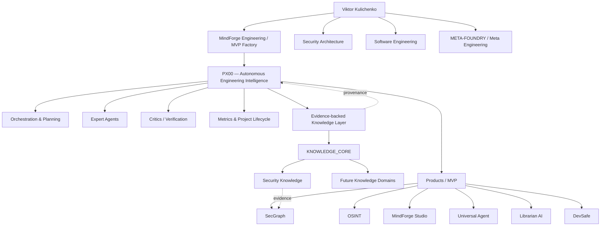

# VIKTOR KULICHENKO

### Security Architecture · AI Systems · Knowledge Engineering · Software Engineering

> **Engineering systems that can explain why they were built this way.**

I design secure, knowledge-driven software and AI systems with an emphasis on explainable engineering decisions, reproducible experiments, evidence-backed architecture and security by design.

**Portfolio status:** evidence-backed engineering showcase in active refinement  
**Website source:** [Engineering Intelligence](index.html) · **Architecture:** [Ecosystem map](architecture.html) · **Products:** [Product hub](products/index.html) · **Showcase truth model:** [Engineering Showcase](docs/SHOWCASE_INDEX.md) · **Agent metadata:** [`.ai/manifest.yaml`](.ai/manifest.yaml)

---

## Featured engineering

Maturity labels are intentionally conservative. A roadmap, specification or README claim is not treated as shipped functionality without implementation and reproduction evidence.

### 🧠 PX00 — **PROTECTED ACTIVE CORE / ADVANCED MINDFORGE EVOLUTION**
Autonomous Engineering Intelligence direction: an advanced evolution of the MindForge concept combining orchestration, planning, expert agents, critics and verification, progress metrics, project lifecycle control and evidence-backed knowledge. PX00 is intentionally **not restructured, renamed, merged or moved** during portfolio normalization; the portfolio describes only its architectural role.

### 📚 [KNOWLEDGE_CORE](https://github.com/VictorKVS/KNOWLEDGE_CORE) — **ACTIVE KNOWLEDGE SYSTEM**
Evidence-driven knowledge infrastructure for provenance, requirements, professional knowledge and security knowledge. Active and future knowledge-base domains remain protected from premature consolidation while their boundaries are still being established.

### 🔎 [OSINT_deepseek](https://github.com/VictorKVS/OSINT_deepseek) — **SHOWCASE / VERIFIED DEV BASELINE / ACTIVE DEVELOPMENT**
Structured OSINT analyst workflows with automation, provenance and reproducible decision lineage. The current public evidence records a Python 3.12 clean-checkout DEV baseline, 21 passing automated tests and verified DEV runners; production capabilities remain separately gated. [Evidence page →](products/osint-deepseek.html)

### 🛡 [SecGraph](https://github.com/VictorKVS/SecGraph) — **PRODUCT CONCEPT / IMPLEMENTATION INCOMPLETE**
Knowledge-driven security audit and intelligence product line. Current repository evidence supports a product concept and knowledge specifications, but not yet a reproducibly runnable MVP. [Evidence page →](products/secgraph.html)

### 🧠 [MindForge Studio](https://github.com/VictorKVS/MindForge-Studio) — **SHOWCASE / PARTIAL PRODUCT IMPLEMENTATION**
Current inspectable implementation surface in the MindForge lineage, with concrete code and test assets. Stronger maturity remains gated on clean-host and CI evidence. [Evidence page →](products/mindforge-studio.html)

### 🤖 [MVP / Universal Agent](https://github.com/VictorKVS/MVP) — **PROTOTYPE / PARTIAL IMPLEMENTATION**
Controlled AI-agent gateway direction with implementation evidence for routing, JWT/RBAC, SQL provider integration and observability. The current branch is not yet reproducibly runnable end-to-end. [Evidence page →](products/universal-agent.html)

### 📖 [Librarian AI](https://github.com/VictorKVS/Librarian-AI) — **SHOWCASE CANDIDATE / EVIDENCE-GATED**
Document-to-knowledge pipeline direction with entity extraction, graph tooling, LLM adapters and structured storage. [Evidence page →](products/librarian.html)

### 🛠 [DevSafe](https://github.com/VictorKVS/devsafe) — **SHOWCASE CANDIDATE / PARTIAL IMPLEMENTATION**
Developer-safety and DevSecOps automation with concrete core modules and test assets. MVP promotion remains gated on a clean-host end-to-end proof. [Evidence page →](products/devsafe.html)

### 🏭 [META-FOUNDRY](https://github.com/VictorKVS/META-FOUNDRY) — **PLATFORM / ARCHITECTURE VISION**
Meta-engineering layer connecting AI, security, knowledge systems and system architecture. It is presented as architecture and vision, not as a claim that every envisioned component is shipped. [Architecture page →](products/meta-foundry.html)

[Explore the product hub →](products/index.html) · [See the working showcase truth model →](docs/SHOWCASE_INDEX.md)

---

## Ecosystem architecture

[Explore the full ecosystem architecture →](architecture.html)

---

## Evidence-driven engineering

The target is not the cleverest solution. The target is the **smallest reliable solution that satisfies the real constraints**.

Technical decisions should be traceable through:

`Context → Constraints → Alternatives → Evidence → Decision → Implementation → Tests → Security Review → Measurement`

A project is not promoted to **MVP** merely because a README uses the word. Flagship repositories are expected to show a reproducible execution path, current feature boundary, architecture, tests or validation evidence, known limitations and current status.

---

## Portfolio normalization policy

The GitHub account contains current products, active knowledge-building work, architecture lineage and substantial learning history. The transformation preserves all of them but separates their public roles.

- `PX00` is `PROTECTED / ACTIVE CORE / SHOWCASE`: describe architecturally, do not restructure it.
- Active and future knowledge-base repositories are `RESERVED / FUTURE KB` while the corpus is still being built.
- Recently active repositories are left in place.
- Older repositories are classified before any move as `SHOWCASE / LEARNING / ARCHIVE / MERGE-CANDIDATE`.
- No destructive cleanup is performed merely for visual neatness.
- Historical coursework is collapsed into an [Engineering Journey](journey.html) instead of competing with current products.
- Human-readable navigation is paired with agent-readable `.ai/` metadata.

[Repository classification →](docs/REPOSITORY_CLASSIFICATION.md) · [Transformation plan →](docs/PORTFOLIO_TRANSFORMATION_PLAN.md)

---

**GitHub:** [VictorKVS](https://github.com/VictorKVS) · **Static showcase:** [site source](index.html)

Building secure systems. Engineering intelligence. Sharing knowledge.
