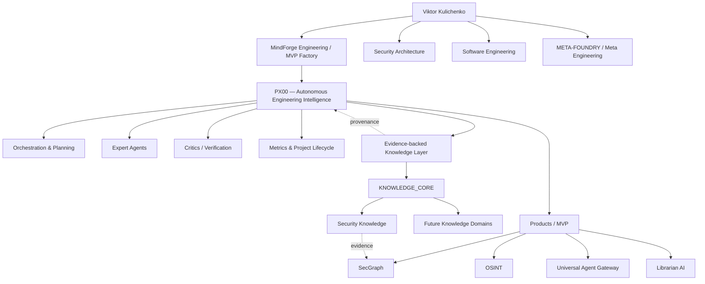

# VIKTOR KULICHENKO

### Security Architecture · AI Systems · Knowledge Engineering · Software Engineering

> **Engineering systems that can explain why they were built this way.**

I design secure, knowledge-driven software and AI systems with an emphasis on explainable engineering decisions, reproducible experiments, evidence-backed architecture and security by design.

**Portfolio status:** active transformation into an evidence-backed MVP showcase  
**Architecture:** [Ecosystem map](docs/ECOSYSTEM.md) · **Showcase index:** [Engineering Showcase](docs/SHOWCASE_INDEX.md) · **Transformation plan:** [Portfolio plan](docs/PORTFOLIO_TRANSFORMATION_PLAN.md) · **Agent metadata:** [`.ai/manifest.yaml`](.ai/manifest.yaml)

---

## Featured engineering

The repositories below are the current flagship candidates. Maturity labels are intentionally conservative and are upgraded only after repository-level evidence review.

### 🧠 PX00 — **PROTECTED ACTIVE CORE / ADVANCED MINDFORGE EVOLUTION**
Autonomous Engineering Intelligence direction: an advanced evolution of the MindForge concept combining orchestration, planning, expert agents, critics and verification, progress metrics, project lifecycle control and evidence-backed knowledge. PX00 is intentionally **not restructured, renamed, merged or moved** while active development continues; the portfolio only describes its architectural role.

### 📚 [KNOWLEDGE_CORE](https://github.com/VictorKVS/KNOWLEDGE_CORE) — **ACTIVE KNOWLEDGE SYSTEM**
Evidence-driven knowledge infrastructure for engineering and security. Current work includes source provenance, atomic requirement verification, CI proof floors, cross-domain security knowledge and adversarial completeness checks. Additional knowledge domains are expected to grow for the next development phase and are therefore protected from premature cleanup or consolidation.

### 🛡 [SecGraph](https://github.com/VictorKVS/SecGraph) — **PRODUCT / MVP CANDIDATE**
Knowledge-driven security audit, intelligence and pentest platform. The portfolio audit is verifying the exact runnable MVP boundary before promoting the maturity label.

### 🔎 [OSINT_deepseek](https://github.com/VictorKVS/OSINT_deepseek) — **ACTIVE DEVELOPMENT**
OSINT engineering project focused on structured analyst workflows, automation, evidence and reproducible decision lineage.

### 🧠 [MindForge Studio](https://github.com/VictorKVS/MindForge-Studio) — **ACTIVE PRODUCT REPO**
Engineering environment for the MindForge ecosystem. MindForge represents the engineering/MVP-factory lineage; PX00 is positioned above it as the advanced autonomous engineering-intelligence evolution rather than as a replacement to be merged during portfolio cleanup.

### 🤖 [MVP / Universal Agent](https://github.com/VictorKVS/MVP) — **PROTOTYPE / MVP SPEC**
Universal Agent Gateway direction: a minimal controlled gateway for AI-agent actions with policy/decision logic, provider integration, security boundaries and audit logs. Runnable evidence is being verified before a stronger maturity claim.

### 🏭 [META-FOUNDRY](https://github.com/VictorKVS/META-FOUNDRY) — **PLATFORM VISION**
Meta-engineering layer connecting AI, security, knowledge systems and system architecture. It is presented as an ecosystem architecture layer, not as a claim that every envisioned component is already shipped.

[See the working showcase truth model →](docs/SHOWCASE_INDEX.md)

---

## Ecosystem architecture

[Explore the full ecosystem architecture →](docs/ECOSYSTEM.md)

---

## Engineering domains

| 🛡 Security Architecture | 🧠 AI Systems & Agents | ⚙️ Software Engineering | 📚 Knowledge Engineering |
|---|---|---|---|
| Security architecture | MindForge / PX00 | Python | Engineering knowledge |
| Threat modeling | Agent systems | Go | Security knowledge |
| DevSecOps | RAG / MCP | C++ | Product knowledge |
| OSINT | Knowledge graphs | Backend / Web | Research & evidence |
| Security automation | AI research | Databases / Linux | ADR / benchmarks |

---

## Evidence-driven engineering

The target is not the cleverest solution. The target is the **smallest reliable solution that satisfies the real constraints**.

Technical decisions should be traceable through:

`Context → Constraints → Alternatives → Evidence → Decision → Implementation → Tests → Security Review → Measurement`

The portfolio is being normalized around the same principle. A project will not be promoted to **MVP** merely because a README uses the word. Flagship repositories are expected to show a reproducible execution path, current feature boundary, architecture, tests or validation evidence, known limitations and current status.

Knowledge bases in this ecosystem connect official documentation, standards, research, implementation evidence and reproducible experiments to engineering decisions. Both people and agents should be able to answer not only **what** was chosen, but **why**.

---

## Portfolio normalization policy

The GitHub account contains current products, active knowledge-building work and a substantial learning history. The transformation keeps all three but separates their public roles.

Current rules:

- `PX00` is `PROTECTED / ACTIVE CORE / SHOWCASE`: describe and link architecturally, but do not restructure it;
- active and future knowledge-base repositories are `RESERVED / FUTURE KB` and are not cleaned up while the knowledge corpus is still being built;
- repositories with recent active work are left in place;
- older repositories are classified before any move as `SHOWCASE / LEARNING / ARCHIVE / MERGE`;
- no destructive cleanup is performed merely for visual neatness;
- flagship README contracts expose problem, current capability, architecture, evidence, limitations and roadmap;
- human-readable navigation is paired with agent-readable `.ai/` metadata.

[Read the full transformation plan →](docs/PORTFOLIO_TRANSFORMATION_PLAN.md)

---

**GitHub:** [VictorKVS](https://github.com/VictorKVS) · **Portfolio site:** planned · **LinkedIn:** to be connected

Building secure systems. Engineering intelligence. Sharing knowledge.
