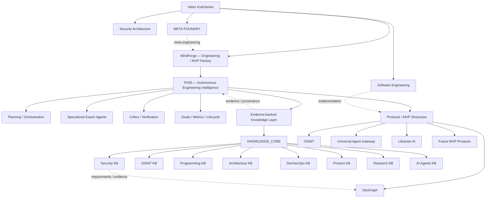

# VictorKVS Engineering Ecosystem

> Human-readable map of the portfolio. Machine-readable metadata lives in [`/.ai/manifest.yaml`](../.ai/manifest.yaml).

## Target architecture

## Architectural interpretation

### MindForge
MindForge is the engineering and MVP-factory lineage: a place where ideas, experiments, engineering workflows and product prototypes are formed and tested.

### PX00
PX00 is positioned as the **advanced autonomous evolution of the MindForge concept**: an Autonomous Engineering Intelligence layer coordinating planning, expert agents, critics, evidence, progress metrics and project lifecycle. It is an active core project and is protected from repository restructuring.

### Knowledge layer
`KNOWLEDGE_CORE` and future domain knowledge bases form the evidence layer. During the current knowledge-building phase these repositories must not be prematurely merged, renamed or archived merely to simplify the public repository list. Their final placement is decided after domain boundaries stabilize.

### Product / MVP layer
Products are the externally inspectable outputs of the ecosystem. A repository is promoted to the public MVP showcase only after its runnable boundary, evidence, limitations and reproduction path have been reviewed.

## Portfolio transformation rules

1. **PX00 is protected.** No rename, merge, archive, move or cleanup mutation is permitted as part of portfolio normalization.
2. **Active/future KB repositories are reserved.** They remain untouched while knowledge domains are being filled and separated.
3. **Recent active repositories remain in place.** Age is only a candidate signal, never sufficient reason for destructive action.
4. **Older repositories are classified first.** Allowed destinations: `SHOWCASE`, `LEARNING`, `ARCHIVE`, `MERGE-CANDIDATE`.
5. **No deletion-first cleanup.** History is preserved until a canonical successor and migration decision are verified.
6. **Maturity claims require evidence.** README wording alone never upgrades a project to MVP/production.
7. **Human and agent navigation coexist.** Flagships progressively expose concise README navigation and `.ai/` metadata.

## Public layers

### Flagship / active core
PX00, KNOWLEDGE_CORE, SecGraph, OSINT_deepseek, MindForge Studio and other verified product lines.

### Product candidates
Universal Agent, Librarian AI, DevSafe and other repositories after executable-scope review.

### Reserved knowledge work
Current and future KB repositories while the multi-domain knowledge corpus is being populated.

### Research / experiments
Useful prototypes and investigations that are not yet product claims.

### Learning archive
Coursework and historical exercises retained as evidence of progression but removed from the visual foreground of the engineering showcase.

---

[← Portfolio root](../README.md)
