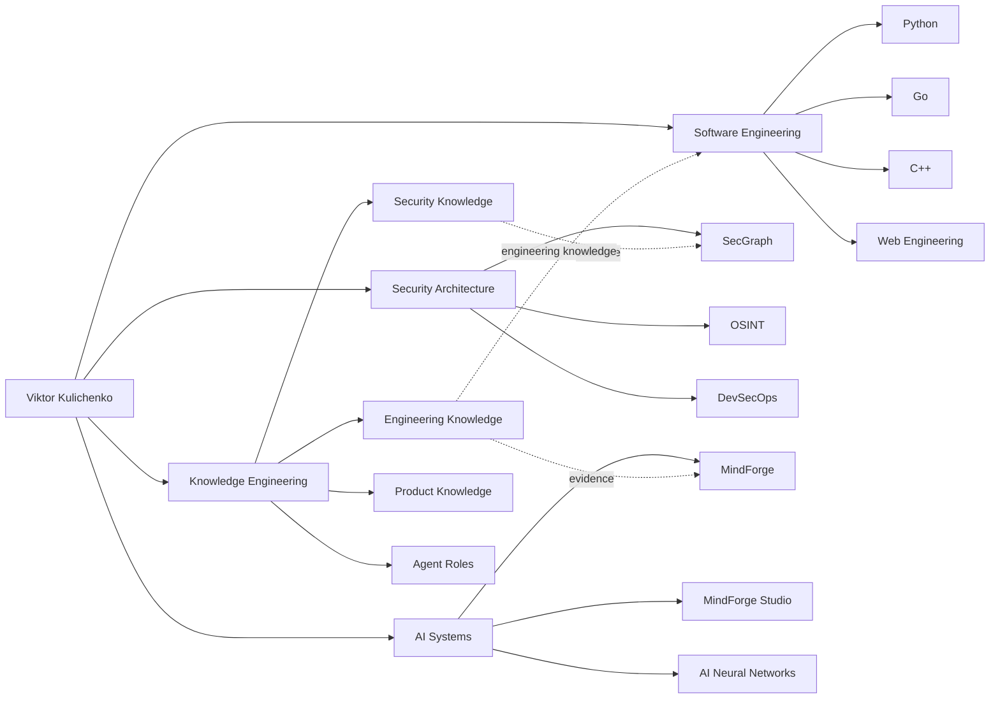

# VictorKVS Engineering Ecosystem

> Human-readable map of the portfolio. Machine-readable metadata lives in [`/.ai/manifest.yaml`](../.ai/manifest.yaml).

## Architecture

## Navigation model

Every flagship repository should eventually provide:

- a short human-readable purpose;
- an ecosystem diagram showing its place;
- links back to this portfolio root;
- links to parent and related projects;
- architecture and decision records;
- evidence and source references where technical claims are made;
- a machine-readable `.ai/` manifest for agents.

## Portfolio layers

### Security Architecture
Security architecture, threat modeling, DevSecOps, OSINT, security automation, compliance and evidence-driven assessment.

### AI Systems
MindForge, agent systems, RAG, MCP, knowledge graphs, research and automation.

### Software Engineering
Python, Go and C++, backend and web engineering, databases, Linux, containers, testing and production engineering.

### Knowledge Engineering
Structured knowledge for both humans and agents: algorithms, alternatives, benchmarks, sources, experiments and decision records.

## Protected active work

The following repositories are intentionally excluded from restructuring while active work is in progress:

- `OSINT_deepseek_poc`
- `PX00`

They will be positioned historically and architecturally after their current development phase is complete.

---

[← Portfolio root](../README.md)
